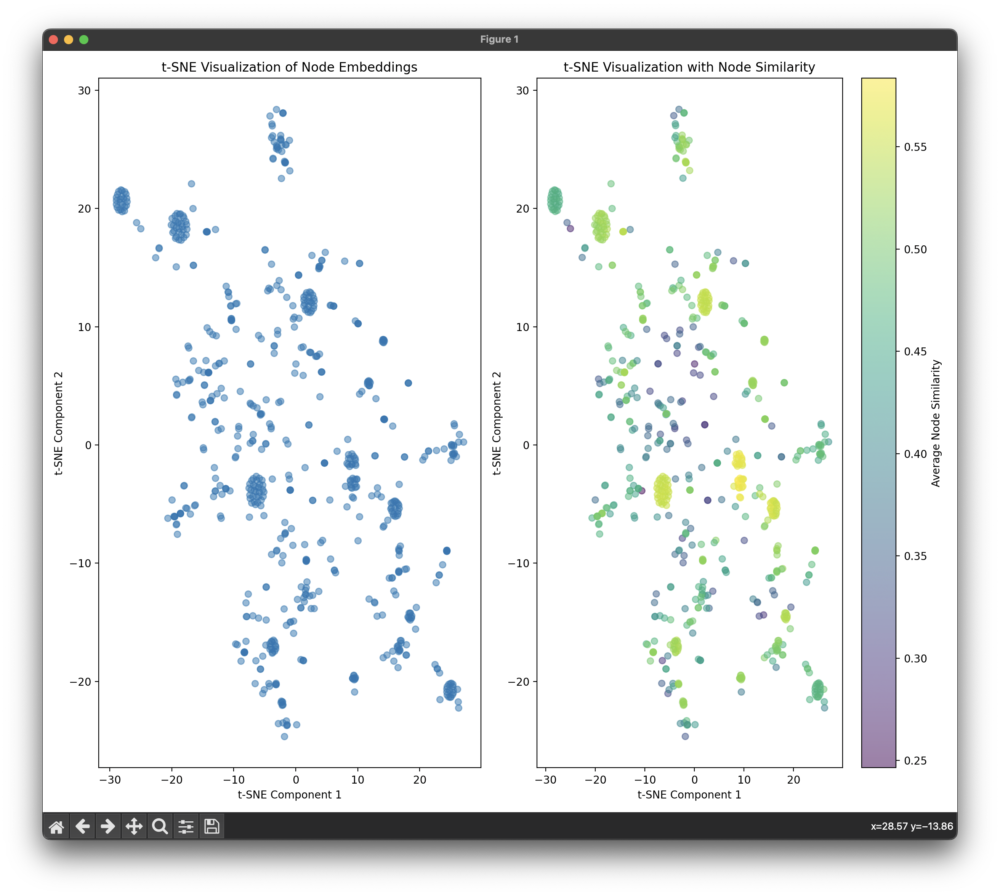

# CS 546 Final Project (Team Helium)
 
Exploratory data analysis of yeast data. Multilevel Community detection of Bio-yeast. Node2Vec for human disease data with tSNE. Cosine similarity using Node2Vec for yeast operon network.

## Table of Contents

- [About](#about)
- [Installation](#installation)
- [Data](#data)
- [Usage](#usage)
- [Important References](#references)


## About

- [x] Node2Vec experiments
- [x] Plotly visualization
- [x] Community detection and visualization (multilevel)
- [x] Graph analysis (Igraph/Networkx)
- [x] Clustering coefficient
- [x] Centrality and degree distribution

## Installation

It is recommended to install using conda and pip.

```bash
conda create -n bio
conda activate bio
conda install pip
pip install -r requirements.txt
```

While installing `pycairo` please follow https://pycairo.readthedocs.io/en/latest/getting_started.html.


## Data

All the data used for the experiments in this project are as below:

1. Yeast mtx list : https://networkrepository.com/bio-yeast.php
2. Disease data:
    1. Disease edgelist : https://snap.stanford.edu/deepnetbio-ismb/ipynb/diseasome.edgelist
    2. Disease Labels: https://snap.stanford.edu/deepnetbio-ismb/ipynb/disease.labels
3. S-cerevisiae (yeast) data for tsne: https://snap.stanford.edu/data/S-cerevisiae.html
4. Fly, cat brain and other eda example datasets: https://neurodata.io/project/connectomes/

## Usage

### Building your own config file
Build a `config.py` with the following information
```python
class Config:
    FILE_LOCATION = '' # location of dataset
    FILE_TYPE = '' # type of dataset : csv, tsv, txt, mtx, graphml

    # Flags to enable/disable functions
    RUN_EDA = True/False
    RUN_DEGREE_DIST =True/False
    RUN_CLUSTERING_COEFF = True/False
    RUN_COMMUNITY_DETECTION = True/False
    RUN_COMMUNITY_DETECTION_PLOT = True/False
    RUN_3D_VISUALIZATION = True/False
    CENTRALITY = True/False
```

### Using runner

```bash
python -m runner --config {config file}
```

Example run
```bash
python -m runner --config configs.eda_configs.yeast_config
```

### Visualiztion parameters (3D/2D) using plotly
- Nodes:
    - Each node in the graph is represented as a marker in the 3D space.
    - The positions of nodes are determined by the layout algorithm, specifically Kamada-Kawai   layout in 3D ('kk').
- Edges:
    - Edges between nodes are depicted as lines in the 3D space.

- Community Detection:
    - The color of each community is determined using a color mapping function based on the community's index.
    - The hue of the color is proportional to the index of the community, ensuring distinct colors for each community.  

### Disease Network Embedding and Visualization with Configurable Parameters

This code analyzes relationships between diseases by first generating a numerical representation for each disease based on its connections to others in a network. It then visualizes these relationships in a multi-dimensional space, with diseases grouped and colored by their types to highlight potential clusters and patterns.
Inspired by [Stanford Deepnet tutorial](https://snap.stanford.edu/deepnetbio-ismb/ipynb/Human+Disease+Network.html).

#### Configurable parameters
Build config files and place them in `configs/tsne_configs`
- Node2Vec with their recommended values
    - Dimensions: 128
    - Walk Length: 80
    - Number of Walks: 10
    - Workers: 8
- t-SNE
    - number of components : 2/3 based on visualization
    - initialization : PCA

```bash
python -m node2vecexp.node2vec_human_diseases --config configs.tsne_configs.human_disease_tsne_config
```


### Analyzing Operon Networks with Node2Vec and t-SNE Visualization for Yeast

This code explores relationships between operons in a network. It reads data on operon connections, creates a network representation, and uses Node2Vec to capture how operons are connected. t-SNE then visualizes these connections in 2D or 3D, allowing researchers to see which operons are similar based on their network context. This is useful for understanding how operon functionality might be related to their network position. By coloring the visualizations by similarity, the code helps identify clusters of potentially co-functioning operons.


#### Configurable parameters
Build config files and place them in `configs/tsne_configs`
- Node2Vec with their recommended values
    - Dimensions: 128
    - Walk Length: 80
    - Number of Walks: 10
    - Workers: 8
- t-SNE
    - number of components : 2/3 based on visualization
    - initialization : PCA

```bash
python -m node2vecexp.node2vec_yeast --config configs.tsne_configs.yeast_tsne_config
```

##

## Visualizations and Conclusions

Based on `bio-yeast` data and  `plotly`.

<p align="center">
  
</p>
<p align="center">
  <em>Visualization for Yeast</em>
</p>

<p align="center">
  
</p>
<p align="center">
  <em>Community Detection for Yeast</em>
</p>


<p align="center">
  
</p>
<p align="center">
  <em>Human disease embedding</em>
</p>


In the scatter plots visualizing disease embeddings, diseases are depicted as points, with red points representing diseases belonging to specific disease classes like developmental or cancer diseases.

We observe that diseases sharing proximity in the two-dimensional map often fall within the same disease class and affect similar organ systems in the human body. This implies that diseases with comparable network characteristics also exhibit similar embeddings, which reflect disease phenotypes. Notably, this observation is intriguing because node2vec learns embeddings in an unsupervised manner, solely leveraging the network structure of the human disease network without any supervised information regarding disease classes.

<p align="center">
  
</p>
<p align="center">
  <em>Similarity in yeast</em>
</p>

The visualization, t-SNE, and cosine similarity analysis collectively provide insights into the structure and dynamics of the network. The t-SNE plot reveals clustering patterns of node embeddings, indicating similarities in network characteristics among closely positioned nodes. Meanwhile, cosine similarity analysis quantifies pairwise similarity between node embeddings, identifying nodes with shared network features. These observations underscore the efficacy of node embeddings in capturing topological and functional attributes of nodes. Overall, these analyses offer valuable understanding of network organization, facilitating tasks such as node classification and community detection, while also shedding light on network dynamics over time or under different conditions.


## Important References
- igraph : https://igraph.org/python/tutorial/0.9.6/
- node2vec (python) : https://github.com/eliorc/node2vec 
- node2vec (paper) : https://arxiv.org/abs/1607.00653
- multilevel community detection : https://igraph.org/c/doc/igraph-Community.html
- Stanford DeepNet : https://snap.stanford.edu/deepnetbio-ismb/ipynb/Human+Disease+Network.html
- cosine similarity : https://en.wikipedia.org/wiki/Cosine_similarity
- tSNE : [scikit learn tsne](https://scikit-learn.org/stable/modules/generated/sklearn.manifold.TSNE.html#:~:text=T%2Ddistributed%20Stochastic%20Neighbor%20Embedding,and%20the%20high%2Ddimensional%20data.)

## Authors

- _Venkat Ramnan K_

- _Subramanya Keshavamurthy_